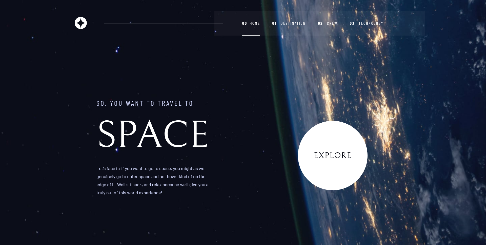
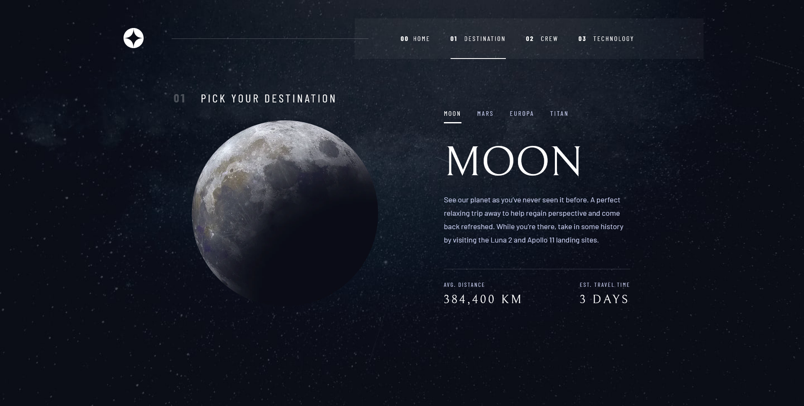

## Frontend Mentor - Space tourism multi-page website

The best project I have done on front end mentor so far. The whole project took about 20 hours to complete. This is done in css and javascript without reaching frameworks. But I will try to do the same project with Tailwindcss and vue.js in the near future to compare how long it would take with those frameworks and to practice on those framework to as well. Feel free to test the page on the Netlify page and on my Github repo.
Thanks.

[Netlify.com](https://moonlit-pavlova-bb55f6.netlify.app/)

